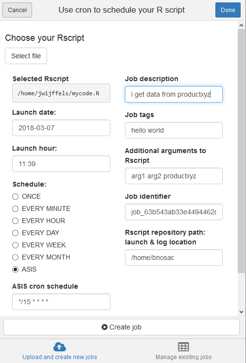

cronR
=========

 

Schedule R scripts/processes with the cron scheduler. This allows R users working on Unix/Linux to automate R processes at specific timepoints from R itself.
Note that if you are looking for a Windows scheduler, you might be interested in the R package taskscheduleR available at
https://github.com/bnosac/taskscheduleR


Basic usage
-----------

This R package allows you to 

* Get the list of scheduled jobs
* Remove scheduled jobs
* Add a job
  + A job is basically a script with R code which is run through Rscript
  + You can schedule tasks 'ONCE', 'EVERY MINUTE', 'EVERY HOUR', 'EVERY DAY', 'EVERY WEEK', 'EVERY MONTH' or any complex schedule
  + The task log contains the stdout & stderr of the Rscript which was run on that timepoint. This log can be found at the same folder as the R script

RStudio add-in
-----------

The package also contains an RStudio addin. If you install the package and use RStudio version 0.99.893 or later you can just click to schedule a task. Just click Addins > Schedule R scripts on Linux/Unix.

 

- Alternatively, run `cronR::cron_rstudioaddin()` to open the addin interface. If you use that addin to schedule scripts, by default it will copy the R scripts to your current working directory and launch the copied scripts from there. A different directory can be specified by passing an argument to the `RscriptRepository` parameter `cronR::cron_rstudioaddin(RscriptRepository = "/path/to/your/deployment/directory")`
- You can also set the `CRON_LIVE` environment variable to specify a default directory to copy scheduled scripts to. This can be done by putting something like `CRON_LIVE="/path/to/your/deployment/directory"` in your .Renviron or .Rprofile file. See ?Startup


Usage
-----------

Some example use cases are shown below, indicating to schedule a script at specific timepoints.

```
library(cronR)
f   <- system.file(package = "cronR", "extdata", "helloworld.R")
cmd <- cron_rscript(f)
cmd

cron_add(command = cmd, frequency = 'minutely', id = 'test1', description = 'My process 1', tags = c('lab', 'xyz'))
cron_add(command = cmd, frequency = 'daily', at='7AM', id = 'test2')
cron_njobs()

cron_ls()
cron_clear(ask = TRUE)
cron_ls()

cmd <- cron_rscript(f, rscript_args = c("productx", "arg2", "123"))
cmd
cron_add(cmd, frequency = 'minutely', id = 'job1', description = 'Customers')
cron_add(cmd, frequency = 'hourly', id = 'job2', description = 'Weather')
cron_add(cmd, frequency = 'hourly', id = 'job3', days_of_week = c(1, 2))
cron_add(cmd, frequency = 'hourly', id = 'job4', at = '00:20', days_of_week = c(1, 2))
cron_add(cmd, frequency = 'daily', id = 'job5', at = '14:20')
cron_add(cmd, frequency = 'daily', id = 'job6', at = '14:20', days_of_week = c(0, 3, 5))
cron_add(cmd, frequency = 'daily', id = 'job7', at = '23:59', days_of_month = c(1, 30))
cron_add(cmd, frequency = 'monthly', id = 'job8', at = '10:30', days_of_month = 'first', days_of_week = '*')
cron_add(cmd, frequency = '@reboot', id = 'job9', description = 'Good morning')
cron_add(cmd, frequency = '*/15 * * * *', id = 'job10', description = 'Every 15 min')   
cron_ls()
cron_clear(ask = TRUE)
```

By default, when you use the functions `cron_add`, `cron_rm`, `cron_clear`, `cron_load`, a prompt will ask for your permission to update the cron schedule, unless you put the argument `ask=FALSE` in each of these functions, in which case you automatically allow to update the schedule. (new since R package version 0.6.0)


Install
-----------

Make sure the cron daemon (https://en.wikipedia.org/wiki/Cron) is running. On Debian this is done as follows.
```
sudo apt-get update
sudo apt-get install -y cron
sudo cron start
```

If you want the RStudio add-in to work, also install miniUI, shiny and shinyFiles
```
install.packages('miniUI')
install.packages('shiny')
install.packages('shinyFiles')
```

Now have a look at `?cron_add` or start the RStudio addin

Notes
-----------

- Consider adding `options(echo = TRUE)` at the start of your R scripts in order to debug your scripts in case of errors.
- Consider using argument `env` when calling `cron_add` if you need specific environment variables to be used in your script, These will be prepended to your script. E.g. as follows where you replace dry_run to FALSE to add it to your cron job list.

```
cmd <- cron_rscript("/path/to/your/script.R")
cron_add(cmd, frequency = 'minutely', id = 'job1', description = 'Customers', 
         env = c(LANG = "en_US.UTF-8", R_LIBS_USER = Sys.getenv("R_LIBS_USER"), YOUR_PROJECT_XYZ = getwd()), 
         ask = FALSE, dry_run = TRUE)
```

- Currently, `cronR` does not preserve or handle cron jobs not
generated through the package. This will be handled some time in
the future. To be safe, you should run `cron_save("cron.backup")`
before fiddling around.

